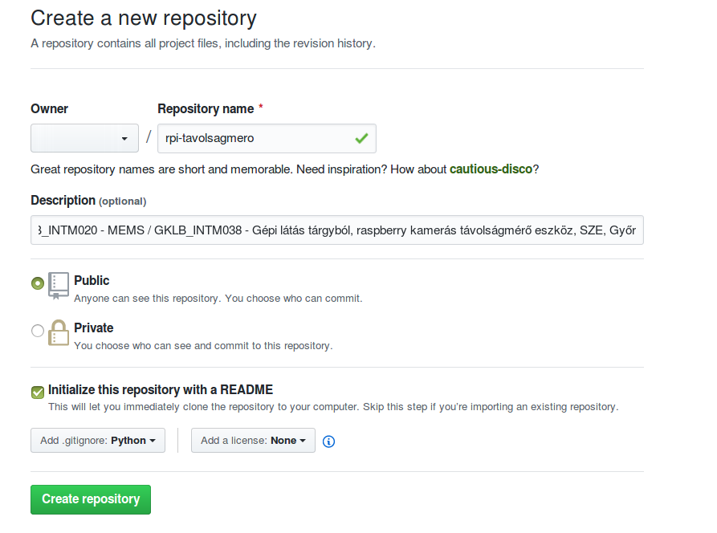
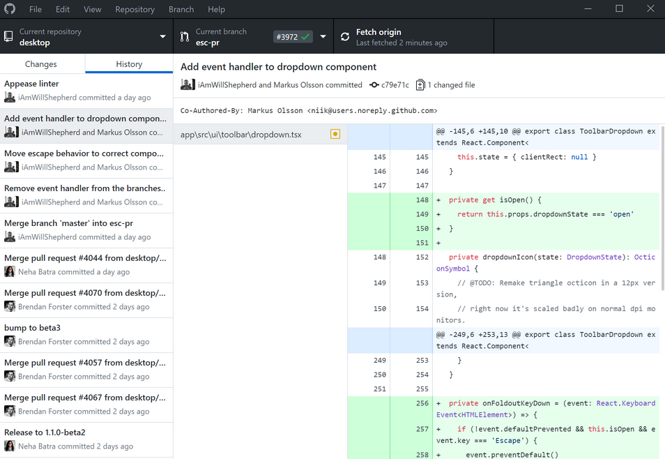
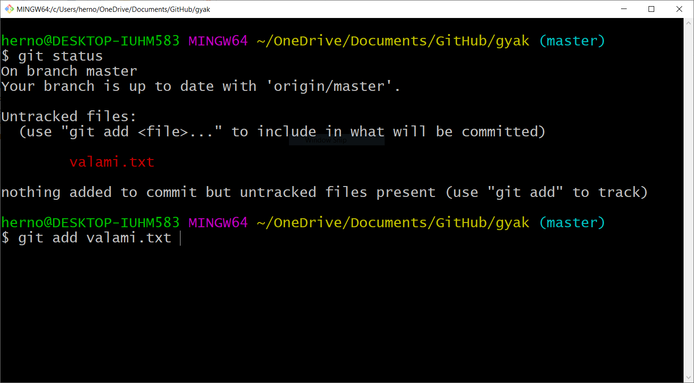
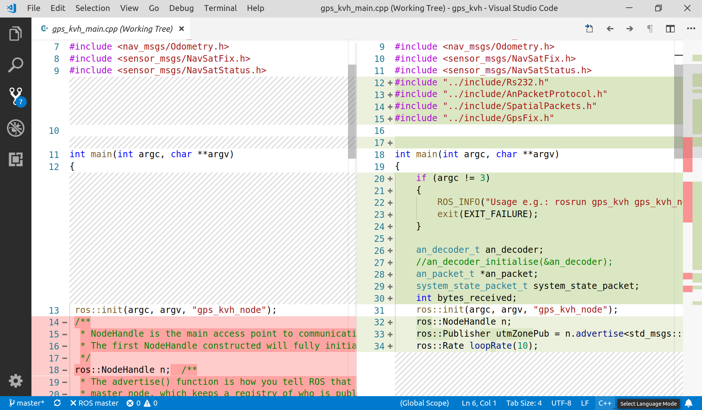
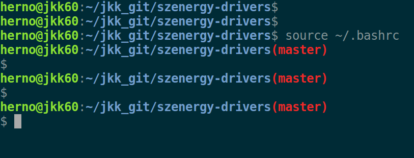

# Git tutorial
Ez a rövid leírás git és GitHub segédleteket tartalmaz, leginkább a féléves feldatokra vonatkozólag. (leginkább GKLB_INTM038 - Gépi látás, GKLB_INTM020 - Mikroelektromechanikai rendszerek, NGB_IN040_1 - Szimulációs technikák, NGB_IN039_1 - Tudományos szoftverek tárgyakból)

## A *féléves* feladatnál pozitív hatást kelt:
- :+1: Jól követhető magyar és akár angol nyelvű dokumentáció is.
- :+1: Alap információk a `README.md`-ben, dokumentáció a `/wiki`-ben.
- :+1: Issue-k.
- :+1: Branch-ek.
- :+1: Gitignore.
- :+1: Licensz.
- :+1: Repository topic-ok, köztük a tárgykód és a SZE.

## *Komoly hibák*, ami miatt a *féléves* akár több érdemjeggyel is rosszabb  lehet:
- :rage: Tömörített állomány a GitHub repositoryban (pl. `zip` és még rosszabb, ha `rar`). Kivétel lehet, ha direkt tömörített állománykezelés a cél, de forráskód, kép, stb. soha ne kerüljön így fel. 
- :rage: Csapatban csak egy hallgató commitol. (Ez nyilván nem vonatkozis egyfős feladatokra).
- :rage: Kevés commit (~10 alatt). Azért lenne fontos a megfelelő számú commit, mert ebből tudjuk, megítélni, hogyan haladt előre a munkafolyamat, ki, mit és mikor dolgozott.
- :rage: Nincs wiki oldal.
- :rage: A dokumentáció pdf / docx-ként feltöltve a `/wiki` helyett.
- :rage: File upload commit helyett.
- :rage: Forráskód kiképmetszőzve markdown szintaxis kiemelés helyett. (Mivel képként nem másolható, kereshető, stb a kód.)

## Féléves feladat kezelése GitHub-on - Linux alatt
*Opcionális*: Kezdő Linux- (ebben a leírásban értsd Raspbian, Ubuntu, Ubuntu Mate) felhasználóknak ajánlott az alapvető terminál-kezelést bemutató gyakorlat: [linuxtut.md](linuxtut.md) végigvitele.

*Opcionális*: Amennyiben a `git` parancsra, `No command 'git' found` a válasz telepítsük a git-et, mint verziókezelőt:

```bash
$ sudo apt-get install git
```

*Opcionális*: GitHub user regisztráció.

Navigáljnk a [github.com](https://github.com/) oldalra, jelentkezzünk be, a repository szöveg mellett egy zöld `New` gomb található, hozzunk létre repository-t. A neve legyen beszédes, a példában `rpi-tavolsagmero`, de ha pl. időjárás állomás a cél, akkor lehet mondjuk `weather-station` vagy `idojaras-allomas`. Pl:



Terminálban lépjünk a felhasználónk könyvtárába. Ha `marika` felhasználóval vagyunk belépve `/home/marika` tartalmazza a fájlainkat. 
Ebben az esetben navigáljunk `/home/marika`, röviden `~` könyvtárba. Ezt így tehetjük meg:

```bash
$ cd ~
```

(Nem biztos, hogy most bármi változik, alapvetően lehet, hogy már ott is voltunk.)

Klónozzuk a github-on létrehozott repository-t:
```bash
$ git clone https://github.com/marika2002/rpi-tavolsagmero.git
```

Nyissuk meg a `README.md` fájlt (pl. `code README.md`), majd írjunk 2 mondatot a projektünkről, illesszünk be táblázatot / linket / kódot, szintaxis kiemeléssel vagy egyéb formázást: [pl](https://github.com/adam-p/markdown-here/wiki/Markdown-Cheatsheet).

Készítsünk egy `src` mappát, hozzuk létre a `hello.py` fájlt, írjunk bele rövid python kódot.

Ellenőrizzük a repo státuszát:

``` bash
$ git status

On branch master
Your branch is up-to-date with 'origin/master'.
Changes not staged for commit:
  (use "git add <file>..." to update what will be committed)
  (use "git checkout -- <file>..." to discard changes in working directory)

	modified:   README.md

Untracked files:
  (use "git add <file>..." to include in what will be committed)

    src/hello.py

no changes added to commit (use "git add" and/or "git commit -a")
```

Adjuk hozzá a git add parancs után felsorlva az egyetlen új fájlunkat, vagy röviden az összeset, így:

``` bash
$ git add .
```

*Opcionális*: ellenőrizzük újra a státuszt.

Commitoljuk a változtatásokat:
``` bash
$ git commit -m "Inicializalas, hello.py hozzaadva"
```

Hogy ne csak lokálisan legyen commitolva, pusholjuk is a változtatást:
``` bash
$ git push origin master
```

Ezután írjuk be a felhasználónév, jelszó párost, majd ellenőrizzük a GitHub weboldalán, mi történt.

## Féléves feladat kezelése GitHub-on - Windows alatt
Windowson van GUI felület is:



Vagy rendelkezésre áll a Linux-hoz hasonló parancssor:



## VS Code git
A VS Code beépített verziókezelő funkciói pl: commit, push, pull, diff nézet, stb. [A vscode.md egyéb VS Code-al kapcsolatos tudnivalókról is ír.](vscode.md)


## Branch megjelenítése Linux bash-ben
*Opcionális, de hasznos lehet*: Keressük meg és módosítsuk a `~/.bashrc` fájlban a következő részt. 

*(VS code használatával a következő parancs: `code ~/.bashrc`)*

``` bash
if [ "$color_prompt" = yes ]; then
    PS1='${debian_chroot:+($debian_chroot)}\[\033[01;32m\]\u@\h\[\033[00m\]:\[\033[01;34m\]\w\[\033[00m\]\$ '
else
    PS1='${debian_chroot:+($debian_chroot)}\u@\h:\w\$ '
fi
unset color_prompt force_color_prompt
```

Miután megvan cseréljük a következő részre:

``` bash
parse_git_branch() {
 git branch 2> /dev/null | sed -e '/^[^*]/d' -e 's/* \(.*\)/(\1)/'
}
if [ "$color_prompt" = yes ]; then
 PS1='${debian_chroot:+($debian_chroot)}\[\033[01;32m\]\u@\h\[\033[00m\]:\[\033[01;34m\]\w\[\033[01;31m\]$(parse_git_branch)\[\033[00m\]\n\$ '
else
 PS1='${debian_chroot:+($debian_chroot)}\u@\h:\w$(parse_git_branch)\\n$ '
fi
``` 
Mentsünk, majd a `source ~/.bashrc`, illetve minden új terminálnyitás hatására git repository-t tartalmazó könyvtárban a következőhöz hasonló bash fogad majd minket:





## Hasznos linkek
- https://lab.github.com/
- http://rogerdudler.github.io/git-guide/
- https://git-scm.com/book/en/v1/Getting-Started
