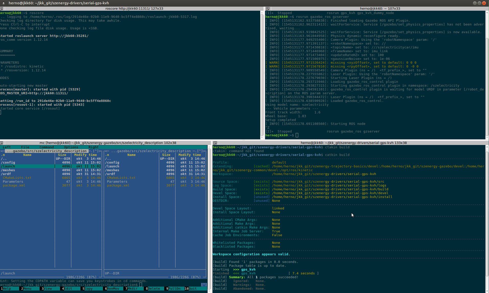

# Linux tutorial
Linuxban (ebben a leírásban értsd Raspbian, Ubuntu, Ubuntu Mate) a legtöbb dolgot lehetséges vagy épp célszerű terminálból intézni.
Ez a tutorial segít a linux terminál alapjainak megismertetésében.

Fontos, hogy a megszokott `ctr`+`v`, `ctr`+`c` helyett itt a `ctr`+`shift`+`v`, `ctr`+`shift`+`c` működik.
Legfontosabb ismernünk a `tab`-bal (illetve `tab`,`tab`-bal) törénő kiegészítést.
Ezen kívül a felfelé nyíllal illetve `ctr`+`r`-rel régi parancsaink között böngészhetünk.

## Alapvető navigáció terminálban
Egy rövid példa apaján mutatjuk be a navigációt. Minden parancsot a terminálban adjunk ki egymás után.

*Opcionális*: Amennyiben a `git` parancsra, No command 'git' found a válasz telepítsük a git-et, mint verziókezelőt:
```bash
sudo apt-get install git
```
Lépjünk a felhasználónk könyvtárába. Ha `marika` felhasználóval vagyunk belépve `/home/marika` tartalmazza a fájlainkat. 
Ebben az esetben navigáljunk `/home/marika`, röviden `~` könyvtárba. Ezt így tehetjük meg:
```bash
cd ~
```
(Nem biztos, hogy most bármi változik, alapvetően lehet, hogy már ott is voltunk.)

Klónozzuk a github-on tárolt repository-t, erre 2 módot mutatunk:
```bash
git clone https://github.com/horverno/sze-academic-rpi
git clone https://github.com/horverno/sze-academic-rpi.git
```
Nézzük meg a navigációt a fájlrendszerben, lépjünk a repository mappájábam majd visza, majd a sze-academic-rpi/img-ba: (használjuk a `tab`-ot)
```bash
cd sze-academic-rpi
cd ..
cd sze-academic-rpi/img
```
Nézzük meg az `ls` paranccsal, hogy milyen fájlok, mappák listázhatók:
```bash
ls
```
Szöveges tartalamat a `cat` paranccsal írhatunk ki. Jeleztessük ki ennek a fájlnak a tartlamát. (Ez `sze-academic-rpi`-ben van, navigáljuk oda.)
```bash
cat linuxtut.md
```


## Ajánlott terminál
A legtöbb oprendszerrel érkező terminál jól használható, de egy idő után bizonyos funkciók miatt érdemes lehet ezt lecserélni.
Erre jó választás lehet a Terminator. Telepítéséhez nyissuk meg az alap terminált (`ctr`+`alt`+`t`). Két lehetséges módon telepíthetjük:

```bash
sudo apt install terminator
sudo apt-get install terminator
```
Állítsuk be alapértelmezett terminálnak:
```bash
sudo update-alternatives --config x-terminal-emulator
```
Itt jelszót fog kérni, a `sudo` miatt, majd válasszuk azt a számot ahol a terminatort látjuk.
Érdemes a színt átállítani, a Solarized dark egy jó választás lehet. Jobb klikk >> Preferences >> Profiles >> Colors >> Solarized dark.
A prompt a terminálban megjelenő szöveg, ami muattja melyik gépen vagyunk. Ennek színét érdemes állítani.
A nano a legegyszerűbb szövegszerkesztő. Nyissuk meg a `~/.bashrc` fájlt benne:
```
nano ~/.bashrc
```
Majd keressük a force_color_prompt szöveget és módostsuk a következő sor, úgy, hogy töröljük előtte a #-et, így:
```
#force_color_prompt=yes
force_color_prompt=yes
```
Végül `ctr`+`x`, üssünk `y`-t, hogy mentenénk, majd `enter`-t, hogy eredeti helyére.
A terminator hasznos funkciója a jobb klikk >> Split horizontally / verically. Kb így néz majd ki:




## Fájl rendszer

| Hely  |  Magyarázat |
|-------|---|
|`/`    | A könyvtárfa kiindulópontj, gyökér  |
|`/boot`| Rendszerindítás, bootloader |
|`/bin` | A futtatható parancsok, binaries |
|`/sbin`| A rendszergazda parancsai, superuser/system bin   |
|`/lib` | Az induláshoz szükséges osztott rendszerkönyvtárak -libraries- illetve, modulok, meghajtóprogramok  |
|`/dev` | Eszközök, min pl USB (`ttyUSB0`) - devices  |
|`/etc` | Beállítófájlok, helyi indító parancsok, jelszavak, hálózati-beállítók, etc. helye.  |
|`/home`| Itt található minden felhasználó saját könyvtárat. Pl. ha, a `sanyi` felhasználóval vagyunk belépve `/home/sanyi` tartalmazza a fájlainkat. A `/home/sanyi/Desktop` vagy röviden `~/Desktop` pl az asztalunk tartalma. |
|`/mnt` | A felcsatolt (mountolt) perifériák, fájlrendszerek helye, mount.  |
|`/proc`| Process information |
|`/root`| A root user könyvtára  |
|`/tmp` |  Temp |
|`/usr` |  Universal system resources, alkalmazások, rendszereszközök |
|`/var` |  Változó adatok pl.: nyomtatási munkák, emailek |


## Olvasnivaló
- https://en.wikipedia.org/wiki/Filesystem_Hierarchy_Standard
- http://sugo.ubuntu.hu/community-doc/hardy/universe/basic/terminal_hasznalata.html
- http://www.letix.hu/
