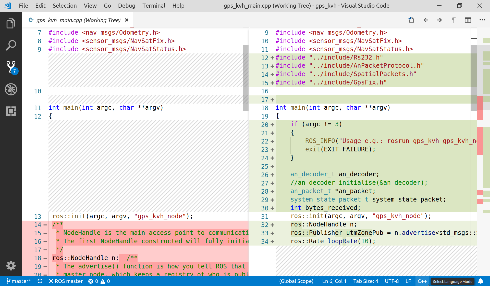

# VS Code
A Visual Studio Code (VS Code) egy könnyűsúlyú, többplatformos (windows, Linux, macOS) kódszerkesztő.

A következőkben pár funciót, extension-t mutatunk be.

## Git
A beépített verziókezelő funkciói pl: commit, push, pull, diff nézet, stb.  
[erről több](https://code.visualstudio.com/docs/editor/versioncontrol#_git-support)

## Debug console
Hibafelderítés, debuggolás, különböző nyelveken, Debug Console parancs: `Ctrl+Shift+Y`. 
[erről több](https://code.visualstudio.com/docs/editor/debugging#_debug-console-repl)

## Több sor / oszlop kijelölése
`Ctrl+Shift+Fel/le` - oszlop kijelölése vagy `Alt` + kattintás.

## Csv
Sok hasznos megjelenítő, stb van `.csv` és `.tsv` fájlokhoz 
[erről több](https://marketplace.visualstudio.com/items?itemName=mechatroner.rainbow-csv)

## Markdown Preview Github Styling
Az extension hasonlóan rendereli le a Markdown (.md) fájlokat, mint a GitHub. 
[erről több](https://marketplace.visualstudio.com/items?itemName=bierner.markdown-preview-github-styles)

## CMake
Szintax kiemelő Catkin / Cmake fájlokhoz.
[erről több](https://marketplace.visualstudio.com/items?itemName=twxs.cmake)

## Shortcut reference
- VS Code gyorsbillenytűk Linux-hoz:  [link](https://code.visualstudio.com/shortcuts/keyboard-shortcuts-linux.pdf)
- VS Code gyorsbillenytűk Windows-hoz: [link](https://code.visualstudio.com/shortcuts/keyboard-shortcuts-windows.pdf)

## Linkek
- https://marketplace.visualstudio.com/
- https://marketplace.visualstudio.com/items?itemName=bierner.markdown-preview-github-styles
- https://marketplace.visualstudio.com/items?itemName=twxs.cmake
- https://code.visualstudio.com/docs/editor/versioncontrol#_git-support
- https://code.visualstudio.com/shortcuts/keyboard-shortcuts-linux.pdf
- https://code.visualstudio.com/shortcuts/keyboard-shortcuts-windows.pdf